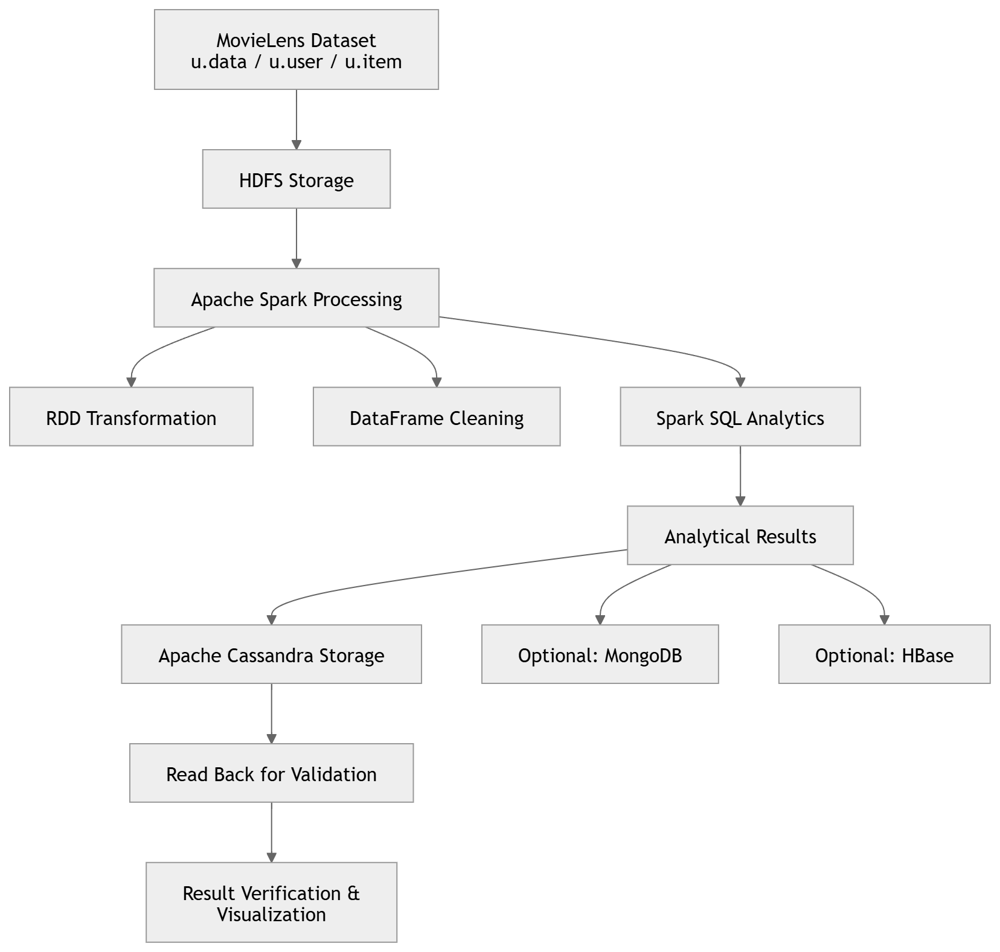
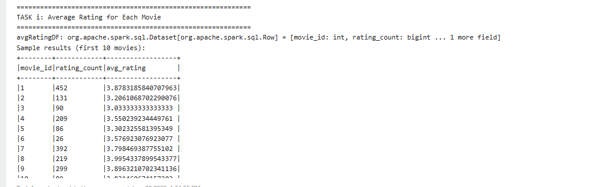
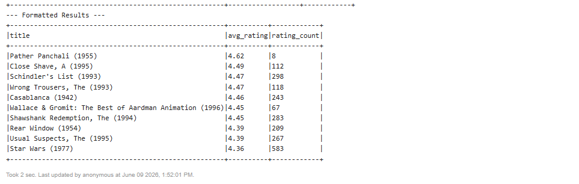
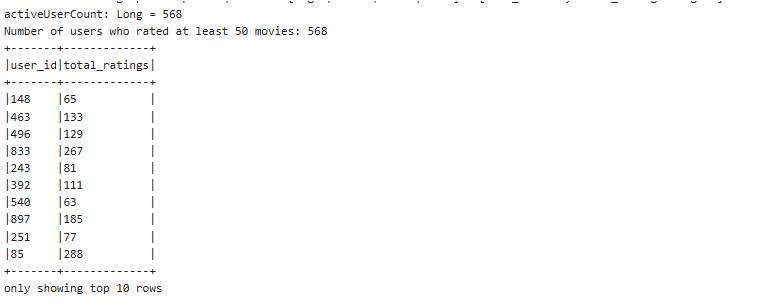
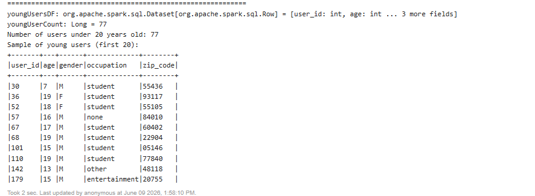
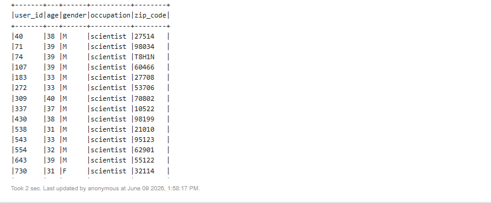
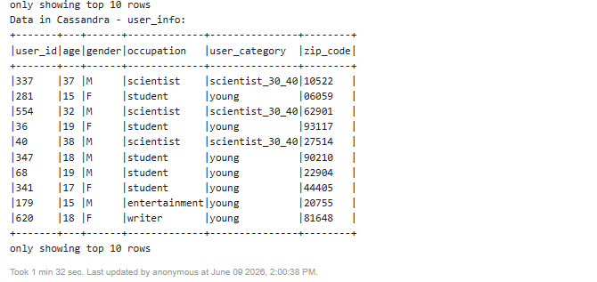

# MovieLens Data Analysis using Apache Spark and Cassandra

## STQD6324 Data Management – Assignment 2 (Semester 2 2025/2026)

### Project Overview

This project implements a complete end-to-end big data analytics pipeline using Apache Spark and Apache Cassandra on the MovieLens 100K dataset.

The project demonstrates distributed data storage, large-scale data processing, data cleaning, analytical querying, NoSQL database integration, and result validation in a big data environment. All five analytical tasks specified in the assignment have been successfully completed. In addition, MongoDB and HBase implementations are included as optional extensions to further demonstrate the ability to work with multiple NoSQL database technologies.

---

## Dataset

### MovieLens 100K Dataset

Dataset Source:

https://grouplens.org/datasets/movielens/

### Files Used

* u.data – User movie rating records
* u.user – User demographic information
* u.item – Movie information and genre labels

### Dataset Statistics

| Item    | Value   |
| ------- | ------- |
| Ratings | 100,000 |
| Users   | 943     |
| Movies  | 1,682   |

---

## Technologies Used

| Technology           | Purpose                               |
| -------------------- | ------------------------------------- |
| Apache Hadoop (HDFS) | Distributed file storage              |
| Apache Spark         | Distributed data processing           |
| Spark SQL            | Data analysis and querying            |
| Apache Cassandra     | NoSQL database storage                |
| Apache Zeppelin      | Development and execution environment |
| MongoDB              | Optional extension                    |
| HBase                | Optional extension                    |

### Environment Configuration

| Component        | Version |
| ---------------- | ------- |
| Python           | 3.9     |
| Scala            | 2.12.15 |
| Apache Spark     | 3.3.0   |
| Hadoop           | 3.2.4   |
| Apache Cassandra | 4.0.8   |
| Apache Zeppelin  | 0.10.1  |

### Python Libraries

* pyspark
* cassandra-driver
* pandas
* numpy

---

## Architecture Diagram

The following diagram illustrates the overall data processing workflow implemented in this project.



---

## Project Workflow

```text
MovieLens Dataset
        ↓
Upload Dataset to HDFS
        ↓
Create Spark RDDs
        ↓
Transform RDDs into DataFrames
        ↓
Data Cleaning & Preprocessing
        ↓
Spark SQL Analytics
        ↓
Store Results in Cassandra
        ↓
Read Data Back from Cassandra
        ↓
Validation & Verification
        ↓
Visualization & Interpretation
```

---

## Data Cleaning and Preprocessing

To ensure data quality before analysis, the following preprocessing procedures were applied:

* Removal of duplicate records
* Validation of movie rating values
* Validation of user age information
* Handling of missing or invalid records
* Schema standardization during DataFrame creation

These steps improve the reliability and consistency of the analytical results.

---

## Assignment Tasks

### Task 1 – Calculate Average Rating for Each Movie

Calculate the average rating score for every movie using Spark SQL aggregation functions.

### Task 2 – Identify Top 10 Highest-Rated Movies

Rank all movies according to average rating and retrieve the ten highest-rated movies.

### Task 3 – Determine Favourite Genres of Active Users

Identify users who rated at least 50 movies and determine their favourite movie genre based on rating frequency.

### Task 4 – Find Users Younger Than 20 Years Old

Filter and retrieve all users whose age is below 20.

### Task 5 – Find Scientists Aged Between 30 and 40

Identify users whose occupation is scientist and whose age falls between 30 and 40 years old.

---

## Cassandra Integration

The analytical results generated by Spark were persisted into Apache Cassandra.

The following operations were performed:

* Create Cassandra keyspace
* Create Cassandra tables
* Write processed Spark DataFrames into Cassandra
* Read Cassandra tables back into Spark
* Validate data consistency between source and stored results

This satisfies all Cassandra integration requirements specified in the assignment.

---

## Optional Extensions

### MongoDB Implementation

All analytical tasks were additionally implemented using MongoDB to demonstrate document-oriented NoSQL data processing.

### HBase Implementation

The same analytical tasks were implemented using HBase to explore distributed column-oriented storage solutions.

These extensions go beyond the minimum assignment requirements and provide additional evidence of multi-database integration capability.

---

## Key Findings

* Average ratings were successfully calculated for all movies.
* The top ten highest-rated movies were identified through Spark SQL ranking.
* Drama was found to be the most popular genre among highly active users.
* Users younger than 20 years old were successfully extracted and analysed.
* A total of 16 scientist users aged between 30 and 40 years old were identified.
* Cassandra successfully stored and retrieved analytical results without data inconsistency.
* MongoDB and HBase implementations demonstrated the flexibility of alternative NoSQL technologies for big data analytics.

---

## Repository Structure

```text
MovieLens-Spark-Cassandra-Analysis
│
├── README.md
├── notebook
│   └── Assignment02.json
│
├── screenshots
│   ├── task1_average_rating.png
│   ├── task2_top10_movies.png
│   ├── task3_favourite_genre.png
│   ├── task4_under20_users.png
│   ├── task5_scientists.png
│   └── cassandra_validation.png
│
└── architecture.png
```

---

## How to Reproduce

### Step 1

Download the MovieLens 100K dataset from:

https://grouplens.org/datasets/movielens/

### Step 2

Upload the following files into HDFS:

* u.data
* u.user
* u.item

### Step 3

Start Hadoop services.

### Step 4

Start Apache Cassandra services.

### Step 5

Open Apache Zeppelin.

### Step 6

Execute all notebook paragraphs sequentially from top to bottom.

### Step 7

Verify analytical outputs, Cassandra validation results, and generated visualizations.

---

---

## Results Screenshots

### Task 1 – Average Rating for Each Movie



---

### Task 2 – Top 10 Highest-Rated Movies



---

### Task 3 – Favourite Genres of Active Users



---

### Task 4 – Users Younger Than 20 Years Old



---

### Task 5 – Scientists Aged Between 30 and 40 Years Old



---

### Cassandra Validation




## Conclusion

This project successfully demonstrates a complete big data analytics workflow using Apache Spark, Hadoop HDFS, and Apache Cassandra.

The MovieLens 100K dataset was processed through distributed storage, Spark RDD and DataFrame transformations, data cleaning, Spark SQL analytics, Cassandra integration, and result validation. All mandatory analytical tasks specified in the assignment were successfully completed.

Furthermore, MongoDB and HBase implementations extend the project beyond the core requirements and demonstrate practical experience with multiple NoSQL database technologies.

Overall, the project showcases essential skills in distributed computing, big data engineering, analytical querying, data management, and NoSQL database integration.

---

## Author

REN SHINENG

STQD6324 Data Management

Semester 2 2025/2026
